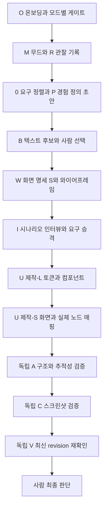

# design-process 핵심 절차 선택 이식 설계

작성일: 2026-09-05. 상태: **설계 제안 — 운영 하네스에 미적용**.

## 1. 결론과 범위

`harnessthon-2-team-4-1`의 전체 오케스트레이터를 복사하지 않고, **P 핵심경험 정의와 S 화면 명세를 현재 0/W/I 절차에 편입**한다. R의 관찰 기록, F1~F3의 명세 기반 제작, Wave Gate의 산출물 검사를 필요한 만큼 보강한다. 현재 M/W/I/U, 사람의 승격·선택, 단일 Figma 제작자, 독립 A/C/V 검증을 유지한다.

이번 산출물은 하네스 변경 설계다. Figma 제작 run을 시작하거나 기존 제품 결정·합격선을 변경하는 문서가 아니다. 아래 신규 필드·게이트·절차는 모두 적용 예정 사양이다.

### 조사 기준

- 원본 루트: `C:/Users/deepnoid/gpters24/harnessthon-2-team-4-1`
- 원본 HEAD: `b2163a6d4b392a0eaa302d9830f85211bc4bd7d9`
- 대상 루트: `C:/Users/deepnoid/gpters24/harnessthon-2-team-4`
- 대상 HEAD: `44407611bc4f2078011894ea355ff9aa0853daa0`
- `design-process`라는 이름의 별도 파일은 원본 파일 목록에서 확인되지 않았다. 이 문서에서는 원본 `README.md`와 `.claude/skills/oss-design-harness/SKILL.md`의 **0→R→P→B→S→F1→F2→F3→A→M→C**를 해당 핵심 단계로 해석했다.
- 원본 세부 근거: 같은 스킬의 `steps/P-persona-experience.md`, `steps/S-screen-spec.md`, `steps/R-reference.md`, `templates/persona-spec.md`, `templates/screen-spec.md`.
- 대상 근거: `AGENTS.md`, 현재 `SKILL.md`, `references/process-acts.md`, `references/stage-a-structural.md`, `references/verify-routing.md`, `templates/contracts/*`, `scripts/harness/check_contracts.py`, `docs/prd.md`, `docs/screen-map.md`.

## 2. 현재 필요한 이유

| 확인한 상태 | 의미 | 보강할 부분 |
|---|---|---|
| 현재 코어에 3축 원칙·CE 추적성·A-F/A-T·C-X·V가 이미 있음 | 검증 철학을 다시 가져올 필요는 적음 | 판정에 필요한 입력을 앞 단계가 생산하도록 연결 |
| 요구 계약 양식에 `core_experiences`가 이미 있음 | CE 개념 자체는 도입되어 있음 | 근거·사용자·관찰 가능한 성공 조건을 만드는 P 절차 명시 |
| `screens`는 목적·진입·단일 CTA·node ID 위주 | 분기·취소·블록 우선순위·완료 상태를 충분히 표현하지 못함 | S 명세를 JSON 계약에 추가 |
| A-T가 JSON의 `screens[].node_id`에서 마크다운 표를 읽도록 서술 | 계약 형식과 검사 절차가 불일치 | CE1~CE7을 실제 JSON 필드와 사실 스냅샷에 매핑 |
| 검사기는 GATE 일부 키와 빈 배열만 검사 | 제목만 있는 문서, 끊긴 참조, 오래된 증거를 놓칠 수 있음 | 필드·참조·revision 검사 추가 |
| 기존 decisions에 1.3 검증 실패와 1.4 인터뷰 승격·제작 기록이 함께 있음 | 과거 FAIL을 현재 Figma 상태로 단정하면 안 됨 | 최신 대상·revision별 증거로 재검, 과거 로그 보존 |

현재 체크아웃의 `design/invitation-scheduler/contracts/requirements.json`은 조사한 파일 목록에 없었다. 템플릿의 존재를 실제 요구 계약 완성으로 취급하지 않는다. Figma 실물은 이번 문서 비교에서 조회하지 않았다.

## 3. 원본 단계별 채택표

| 원본 | 결정 | 대상 접점 | 이식 내용 / 제외 내용 |
|---|---|---|---|
| 0 요구 전사 | 보강 | 0 요구 정렬 | PRD 위치·원문·해시로 추적. brief에 PRD 전체를 중복 복제하지 않음 |
| R 레퍼런스 | 부분 채택 | M + `reference-research.md` | 실제 이미지 관찰과 해석 분리, 화면뿐 아니라 흐름 기록. Mobbin을 필수 의존성으로 만들지 않음 |
| P 페르소나·CE | **우선 채택** | 0의 경험 정의 + I의 검증·승격 | 역할·제약→목적→관찰 가능한 성공 조건. `[PRD]/[관찰]/[가설]` 구분 |
| B 발산·수렴 | 현재 유지 | B | Claude 신규 컨텍스트 후보, 텍스트만 생성, 사람 선택. 원본 무개입 선택·후보 Figma 병렬 쓰기는 제외 |
| S 화면 명세 | **우선 채택** | W의 명세 작성 + I 이후 확정 | 화면별 진입·분기·복구·완료·블록·필요 컴포넌트·양방향 추적 |
| F1 파운데이션 | 부분 채택 | U 제작-L | 토큰 선정 근거와 관찰된 범위 구분. 값의 정본은 `_system/brief.md` 유지 |
| F2 컴포넌트 | 부분 채택 | U 제작-L | S의 컴포넌트 요구→실제 ID·variant·의존성 계약. 자체 점검은 제작 점검으로만 기록 |
| F3 화면 조립 | 보강 | U 제작-S | 선택된 명세를 인스턴스로 조립, 실제 node ID와 revision 연결 |
| A/C | 현재 유지·입력 정비 | A-F/A-T/C-X | Shared Ruler 유지. 원본의 C 입력 중 decisions·제작 의도는 제공하지 않음 |
| 원본 M 모션 | 보류 | 필요 시 U 인터랙션 사양 | 현재 M은 무드이므로 이름 충돌. 정적 Figma 과제에 코드 모션 검사·Swift/React 스킬 묶음은 불필요 |
| Wave Gate | 보강 | 기존 GATE + 검사기 | 산출물 실재·내용·참조 검사. `.harness/state.json` 추가하지 않음 |

원본의 Primary 페르소나 1명 강제는 옮기지 않는다. 이 과제의 요구는 **두 사람이 함께 쓰는 커플 앱과 초대받은 지인 경로**다. 화면별 주 사용 역할은 정하되, 어느 역할의 PRD 요구도 중요도 라벨 때문에 누락할 수 없다.

원본의 모든 화면에 5종 상태 강제, IA 대안 3개 강제, 600pt/3탭 같은 수치를 새 합격선으로 자동 승격하지 않는다. 현재 A-T에도 해당 수치가 있으므로 프로젝트 기준의 근거·적용 범위를 점검하고, 변경은 사람의 결정으로 기록한다. iOS 규칙은 플랫폼 적용 범위가 확인된 경우에만 사용한다.

## 4. 통합 흐름

- P에서 경험 초안을 먼저 정의해야 B/W가 목적 없이 진행되지 않는다. I에서는 초안을 실제 과제 수행 결과와 대조하고 확정한다. 시뮬레이션 결과는 관찰 출처에 시뮬레이션이라고 표시한다.
- W가 만드는 S 명세는 기존 `S01` 등의 ID를 그대로 사용한다. 원본 `SC-*`를 새로 부여하지 않는다.
- `LOCK-W` 이후 인터뷰가 화면 구조 변경을 요구하면 기존 UNLOCK 절차를 적용한다. 잠금 없이 조용히 다시 그리지 않는다.
- HTML 로우파이는 현재 `process-acts.md`가 정한 W의 검증 매체 예외를 따른다. 최종 산출물은 Figma다.
- `plan-only`는 문서 계약 설계·내용 검사까지 실행할 수 있다. 대상 Figma가 없는 상태를 build 또는 검증 완료로 표시하지 않는다.

## 5. 단일 원장과 데이터 계약

경로는 프로젝트 설정에서 읽는다. 이 프로젝트의 기존 루트 `design/invitation-scheduler/`를 사용하고 화면별 루트로 이동시키지 않는다. AGENTS의 화면별 예시와 현재 project.json의 앱 단위 경로는 문서 동기화 때 관계를 명시한다.

| 정보 | 정본 | 다른 문서의 사용 방식 |
|---|---|---|
| 원문 요구 | `docs/prd.md` | 요구 계약이 위치·원문 인용·해시 저장 |
| target·승격 기준·가정 | 프로젝트 `brief.md` | 파일·페이지 선택은 이 target 참조 |
| 역할·REQ·CE·화면·전이 | `contracts/requirements.json` | 사람용 화면 지도는 이 계약의 요약으로 정비 |
| 시각 토큰·상태 어휘 | 설정의 `system_brief_path` | 토큰 값 복사 대신 경로/키 참조 |
| 실제 컴포넌트 | `contracts/components.json` | 이름·ID·variant·사용 화면 참조 |
| 선택·LOCK·GATE·판정·카운터 | `decisions.md` | append 기록 유지, 검증자에게 원본 미제공 |
| 실제 노드와 렌더 | `.cache/`·`renders/` | target·revision·수집 시각·측정 범위와 함께 전달 |

새 `persona-spec.md`, `screen-spec.md`, `foundation-spec.md`, `figma-context.md`를 각각 정본으로 추가하지 않는다. P/S의 **작성 방법**은 references에, 산출 데이터는 기존 계약에 넣는다. 필요하면 계약에서 사람용 문서를 파생한다.

### 요구 계약 v2 제안

기존 필드는 유지하고 다음을 추가한다. 아래 필드명과 enum은 제안 사양이며 아직 검사기에 구현되어 있지 않다.

| 위치 | 추가할 필드 | 용도 |
|---|---|---|
| 루트 | `schema_version: 2`, `revision`, `personas[]` | 계약 버전과 역할별 상황·제약·근거 |
| `core_experiences[]` | `persona_refs`, `requirement_refs`, `source_refs`, `approval_ref` | CE를 요구와 승격 기록으로 연결 |
| `screens[]` | `ce_refs`, `blocks[]`, `required_component_refs`, `fixture_refs` | 화면 존재 이유·위계·데이터·컴포넌트 입력 |
| `screens[].blocks[]` | `id`, `purpose`, `priority`, `node_id` | 핵심 요소의 계획과 실물 연결 |
| `flow.edges[]` | `id`, `trigger_node_id`, `condition`, `effect`, `kind` | CTA별 조건·상태 변화·이동/복구 경로 |
| `flow` | `paths[]` | 역할·CE별 시작/끝·경유 edge ID·완료 조건 |
| 증거 묶음 | `revision`, `target_ref`, `captured_at`, `snapshot_ref`, `render_refs`, `coverage_scope` | 문서와 실제 노드·렌더의 동일성 확인 |

`requirements[].kind=core_experience`와 `core_experiences[]`에 CE 본문을 이중 관리하지 않는다. CE 정본은 후자로 정하고 REQ ID를 참조한다. 기존 데이터가 두 위치에 있으면 대조표를 만든 뒤 충돌을 해결한다.

계획 단계의 `node_id`는 null이 정상이다. 실제 제작 후에는 node ID를 채우되 그것만으로 PASS를 부여하지 않는다. `screens_present`, 검증 status 등 판정 필드는 독립 검증 결과로 갱신한다. 계획 커버리지와 실물 충족 판정을 분리한다.

### 청첩장모임 흐름에 대입한 예시 — 미승격 초안

| CE 초안 | 요구 근거 | 관찰 가능한 성공 조건 초안 | 기존 화면 연결 |
|---|---|---|---|
| CE-01 모임 구성 결정 | PRD §4.1~2, §3 중복 소속 | 복수 그룹에 속한 지인을 선택하고 이번 모임의 배정 결과를 확인한다 | S02→S04→S05 |
| CE-02 늦은 회신에도 일정 결정 | PRD §4.3~4, §3 미회신 | 마감 경과·미회신 인원을 확인하고 연장 또는 확정 결과에 도달한다 | S05→S06→S07→S08 |
| CE-03 커플 일정 함께 조망 | PRD §2.3, §4.5 | 두 사람과 공동 모임을 함께 보고 같은 날의 모임들을 구분한다 | S08→S09 |
| CE-04 게스트의 여러 요청 응답 | PRD §2.2 | 커플별 후보에 응답한 후 제출 결과를 확인한다 | S11→완료 상태 또는 목적지 결정 필요 |
| CE-05 진행 상황별 후속 행동 | PRD §4.6 | 회신 대기·확정 대기·확정·다녀옴에서 해당 모임을 찾아 후속 화면에 진입한다 | S01/S10→S06~S09 |

예시는 화면을 추가하라는 승인이나 최종 제품 명세가 아니다. 특히 S11 완료 상태, 중복 그룹과 중복 모임 배정의 의미, 같은 날짜와 실제 시간 충돌의 구분은 기존 승격 기록과 대조한다. PRD가 시간 구간·이동시간 계산까지 확정했다고 해석하지 않는다.

## 6. 게이트와 검증 입력 보강

| 시점 | 통과 조건 제안 | 실패 시 |
|---|---|---|
| 경험 정의→B | 필수 REQ에 연결된 CE 초안, 역할과 관찰 가능한 성공 조건, 근거 위치가 있음 | 0의 경험 정의 보완 |
| W→LOCK-W | 화면·블록·조건 분기·되돌림·종료 경로와 CE 연결, 사람 컨펌 근거가 있음 | W 보완; 잠긴 항목 변경은 UNLOCK |
| I→U | 승격된 REQ/CE와 화면 명세가 일치, 열린 필수 갭이 없음 | I/W 해당 결정으로 반환 |
| 제작-L→제작-S | 필요한 컴포넌트 ID·variant·토큰 참조가 모두 있음 | 제작-L 보완 |
| 제작-S→A | 명세 revision과 같은 대상의 실제 노드 매핑·사실 증거가 있음 | 입력 부족은 BLOCKED, 확인된 누락은 FAIL |
| A→C→V | 각 단계 입력이 같은 target·revision이며 필수 축에 미판정이 없음 | 이전 PASS 재사용 금지, 영향 범위 재검 |

검사기는 자동 승인자가 아니다. 자료 준비 여부와 기계적 정합만 검사하고 사람의 선택·기준 승격을 대신하지 않는다.

### A-T 정정 사양

- CE1~CE3: `core_experiences[].screens`와 `screens[].ce_refs`를 양방향 대조. node ID는 사실 스냅샷에 실제 존재하는지 확인한다.
- CE4: `blocks[].priority`와 해당 `node_id`의 좌표·viewport를 대조한다. 합격선은 확정 기준 참조로만 읽는다.
- CE5: `flow.paths[].edge_refs`로 경로 길이를 계산한다. 의미 없는 고정 3탭 합격선으로 변경하지 않으며 기존 수치의 승인 근거를 확인한다.
- CE6: 복구 edge의 목적지와 실제 트리거가 존재하는지 확인한다. 버튼 이름 존재만으로 연결 성공을 인정하지 않는다.
- CE7: 명세의 화면 ID 집합과 사실 스냅샷의 화면 ID/노드 집합을 비교한다. 같은 JSON 목록을 자기 자신과 비교하지 않는다.

### 리뷰 전달 경계

master가 확정 요구·기준·사실 자료만 추려 절대경로로 전달한다. reviewer는 신규 컨텍스트에서 지정 파일만 읽고 수정하지 않는다. C에는 최신 렌더, 확정 조건, 필요한 A 사실 요약을 제공한다. 원본의 decisions·컨셉 정당화·후보 선택 이유는 제외한다. 검증용 패키지의 해시는 원본 계약과 연결한다.

집계 통계만 있는 스냅샷은 원본 노드 전수 증거와 구별해 `coverage_scope`에 한계를 적는다. 제작자의 자체 집계를 독립 실물 검증으로 승격하지 않는다. 같은 단계의 반복 MCP 조회 대신 한 번 수집한 사실 자료를 공유하고 429는 기존 규약대로 처리한다.

## 7. 구현 파일과 순서

| 순서 | 변경 대상 | 구체 작업 | 담당 |
|---|---|---|---|
| 1 | `references/experience-definition.md` 신규 | P의 근거 라벨·역할·CE 작성 절차를 프로젝트 중립 형태로 축약 | master/cso |
| 1 | `references/screen-specification.md` 신규 | S의 블록·전이·복구·컴포넌트 명세 절차 작성 | master/cso |
| 2 | `templates/contracts/requirements.json` | v2 필드와 정상 null/필수값 조건 추가 | worker |
| 2 | `scripts/harness/check_contracts.py` | 실제 JSON 파싱, ID 중복·dangling ref·역방향 누락·단계별 필수값·증거 revision 검사 | worker |
| 3 | `references/stage-0-alignment.md`, `process-acts.md`, `SKILL.md` | P를 0/I에, S를 W에 연결하고 단일 라우터 유지 | master |
| 3 | `references/stage-a-structural.md`, `verify-routing.md` | JSON과 다른 CE 검사 서술 정정, 기존 실패·LOCK 경로 유지 | master/reviewer 규칙 담당 |
| 4 | 프로젝트 요구 계약, `docs/screen-map.md` | 기존 화면/승격 기록에서 계약 초안 생성, CE·흐름 누락 대조 | cso/worker |
| 5 | `AGENTS.md`, `docs/team-playbook.md` | 0/W/I의 강화 내용·앱 루트·검증 패키지 전달 규약 동기화 | master |

### 기존 run 도입 방식

1. 변경 직전 `brief`·`decisions`·project 설정·계약 파일의 해시와 마지막 GATE를 기록한다. 기존 run ID·라운드·target을 그대로 참조한다.
2. v1 계약은 읽을 수 있도록 하고 v2 신규 필드는 미작성 상태로 변환한다. 과거 완료 단계에 새 게이트를 소급 PASS시키지 않는다.
3. 현재 문서의 LOCK-I와 사용자 승격 내용을 초안 계약에 연결한다. 과거 1.3 FAIL의 해결 여부는 1.4 이후 증거로 대조한다.
4. 먼저 **S05→S06→S07→S08**의 늦은 회신 경로를 문서로 시범 적용한다. 조건 분기·복구·완료·데이터 일관성을 한 흐름에서 점검할 수 있다.
5. 시범 계약을 보완한 뒤 지인 편성, 통합 일정, 게스트 경로로 확장한다. 변경할 필요가 확인된 화면만 후속 improve 대상으로 낸다.
6. 기존 합격선·LOCK과 충돌하는 변경은 이름·근거·영향 화면을 정리한다. 이미 승인된 내용은 다시 승인받지 않는다.

롤백은 새 하네스 코드·템플릿 변경만 되돌리고 프로젝트의 기존 LOCK·판정 이력은 보존한다. 이식 때문에 Figma 노드를 삭제하거나 run 번호를 초기화하지 않는다.

## 8. 구현 완료를 확인할 방법

이번은 문서 변경이므로 하네스 구현 테스트를 수행한 것으로 보고하지 않는다. 후속 구현에서는 아래 실패 사례를 검사기 fixture로 검증한다.

- 정상 계획 계약: node ID가 null이어도 문서 단계 통과, 제작 증거 게이트는 통과하지 않음.
- 제목만 있는 산출물, 미해결 자리표시자 필수값, 없는 output 경로: 진행 차단.
- 없는 REQ/CE/화면/컴포넌트 참조, 단방향 매핑만 존재, CTA 목적지 부재: 구체 ID를 포함한 오류.
- node ID가 채워졌지만 스냅샷에 없음, 다른 target/revision의 렌더: 검증 통과 불가.
- 제작자와 검증자 동일: 정식 검증 입력 거부.
- 필수 CE가 검증 불가인데 나머지 A 항목만 PASS: C/최종 승인으로 진행 불가.
- improve 재개: 과거 실패·카운터 유지, 공통 컴포넌트 변경 시 의존 화면까지 재검 대상으로 산출.
- v1 마이그레이션: 기존 ID·target 참조·LOCK·승격 원문을 보존하고 새 필드만 초안으로 추가.

완료 증거는 수정된 코어·템플릿, 위 검사 결과, 시범 흐름의 문서 계약과 독립 리뷰 기록이다. 디자인의 최종 완료는 기존대로 사람이 판단한다.

## 9. 가정과 후속 결정

| 이름 | 현재 처리 |
|---|---|
| design-process 지칭 범위 | 원본 11단계 파이프라인으로 해석. 다른 문서를 지칭했다면 해당 원문으로 매핑 조정 |
| 이식 범위 | 이번 요청은 설계로 해석하여 이 문서만 생성. 운영 파일 교체·Figma 변경은 후속 구현 범위 |
| P/S 내용의 승격 범위 | CE 예시는 미승격 초안. 기존 승인과의 대조 후 새 제품 판단만 사람에게 제시 |
| A-T/A-4 기준 근거 | 기존 600pt·탭 수·재사용률 기준을 임의 정정하지 않음. 관련 후속 검증 시 승인 근거와 산식을 확인 |
| 현재 Figma 실물 상태 | 로컬 기록만 조사. 제작·검증 착수 시 G-3/G-4와 최신 증거로 확인 |

이 가정들은 실제 프로젝트 계약 초안을 작성하는 시점에 해당 `brief.md` 가정 로그로 옮긴다. 이 문서는 새로운 운영 절차 정본이 아니며, 적용 후 절차 정본은 계속 `oss-design-harness/SKILL.md`와 그 references다.
